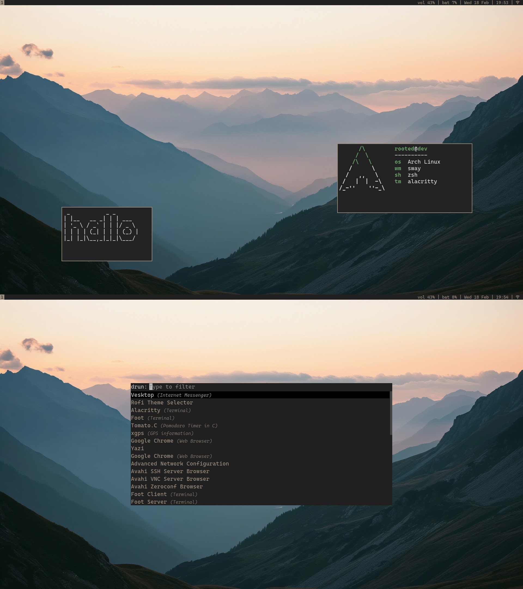

  
  # Sway Dotfiles

  
  
  
  

## Description

A personal [Sway](https://swaywm.org/) window manager dotfiles, tailored for daily use on Arch Linux. The configuration is built around a Wayland-native stack with a focus on minimalism and keyboard-driven workflow. Since this is built specifically for my setup, some components may require adjustments to work on other systems or distributions.

Minimalism and simplicity can be seen in details such as the absence of icons everywhere, emphasizing text, as well as file management tailored for terminal work (using [Yazi](https://github.com/sxyazi/yazi)), which is why I didn't use Dolphin or anything similar to make the experience more nerdy ☝️🤓.

This repository is also planned to be updated in the future.

## Utils

List of software and utils I use.

| Component         | Program    |
|-------------------|------------|
| Windows Manager | [sway](https://github.com/swaywm/sway) + [swayfx](https://github.com/WillPower3309/swayfx) |
| Bar             | [waybar](https://github.com/Alexays/Waybar)      |
| Shell           | [zsh](https://github.com/ohmyzsh/ohmyzsh/wiki/Installing-ZSH) + [starship](https://github.com/starship/starship) |
| Terminal        | [alacritty](https://github.com/alacritty/alacritty)        |
| Audio           | [pulseaudio](https://github.com/pulseaudio/pulseaudio) + [pavucontrol](https://github.com/pulseaudio/pavucontrol) + [sof-firmware](https://github.com/thesofproject/sof)      |
| Notifications   | [swaync](https://github.com/ErikReider/SwayNotificationCenter) |
| Fetch           | [neofetch](https://github.com/dylanaraps/neofetch) + [catnap](https://github.com/iinsertNameHere/catnip) |
| Resource Monitor| [gotop](https://github.com/cjbassi/gotop) |
| Editor          | [neovim](https://github.com/neovim/neovim) |
| Launcher        | [rofi](https://github.com/davatorium/rofi)          |
| Visualiser      | [cava](https://github.com/karlstav/cava)          |
| CLI-utils       | [cowsay](https://github.com/sckott/cowsay), [figlet](https://github.com/cmatsuoka/figlet), [colorscripts](https://github.com/stark/Color-Scripts), [tomato.c](https://github.com/gabrielzschmitz/Tomato.C) |

## Credits

- [Vimichael](https://github.com/vimichael/arch-i3-cfg) used his colorscheme for sway, waybar and rofi.
- [Ericmurphyxyz](https://github.com/ericmurphyxyz/rofi-wifi-menu) used his WiFi menu script for Rofi.
